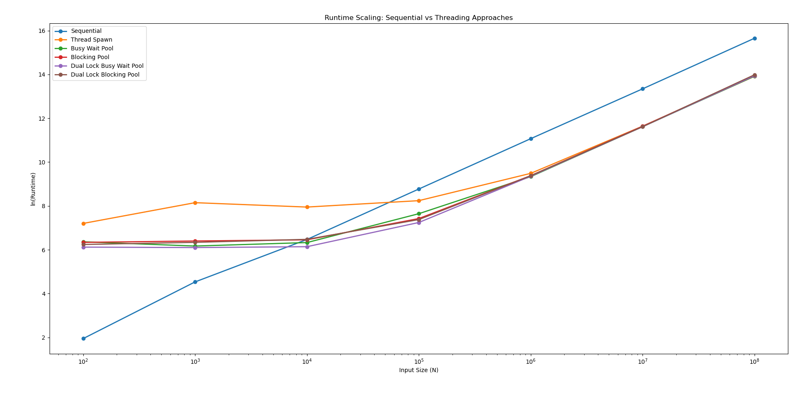

# Simple C++ Thread Pool

A lightweight thread pool implementation built while learning C++ concurrency.

## Features

- Fixed-size worker thread pool
- Task submission using `std::future`
- Dual-lock blocking MPMC task queue
- Move-only task support via custom `function_wrapper`
- Worker threads exit cleanly on shutdown
- Pending tasks remaining in the queue are discarded during destruction

## Structure

```text
.
├── threadpool.hpp          # Thread pool implementation
├── threadsafe_queue.hpp    # Dual-lock MPMC queue
└── function_wrapper.hpp    # Move-only callable wrapper
```
## How to use

```cpp
threadpool pool(no_of_threads);

auto fut = pool.submit(callable);

/*
The submitted callable must be parameterless.
Use std::bind or a lambda to capture any required arguments.
*/

std::cout << fut.get() << '\n';
```

### Shutdown Semantics
Destroying the thread pool signals all worker threads to stop. Any tasks still waiting in the queue are discarded, while tasks already being executed are allowed to finish before the worker threads exit.

## Performance Evaluation

The thread pool was benchmarked against several execution strategies using a parallel accumulation workload across varying input sizes.

### Compared Approaches

- Sequential
- Thread Spawn
- Single-Lock Busy-Wait Pool
- Single-Lock Blocking Pool
- Dual-Lock Busy-Wait Pool
- Dual-Lock Blocking Pool

### Results



The benchmark shows that:

- Thread creation overhead dominates for small workloads.
- Reusing worker threads is significantly more efficient than spawning threads repeatedly.
- The dual-lock queue reduces contention between producers and consumers, improving throughput over the single-lock implementation.
- The dual-lock busy-wait pool consistently achieves the lowest runtime among all thread-pool variants.
- Blocking implementations provide comparable performance while avoiding unnecessary CPU utilization when idle.
- As task size increases, synchronization overhead becomes negligible compared to the computation itself, causing all thread-pool variants to converge.

### Key Observation

The dual-lock queue reduces producer-consumer contention, resulting in consistently lower synchronization overhead than the single-lock design. Additionally, while busy-waiting achieves the lowest runtime by avoiding wake-up latency, the blocking implementation delivers comparable performance for larger workloads without consuming CPU resources when idle.

## Current Limitations
- No work stealing.
- No dynamic thread management.
- No lock-free data structures.

## Future Improvements

- Add local worker queues.
- Implement work stealing.
- Investigate dynamic thread management.
- Investigate lock-free task queues.

## Requirements
- C++17 or later