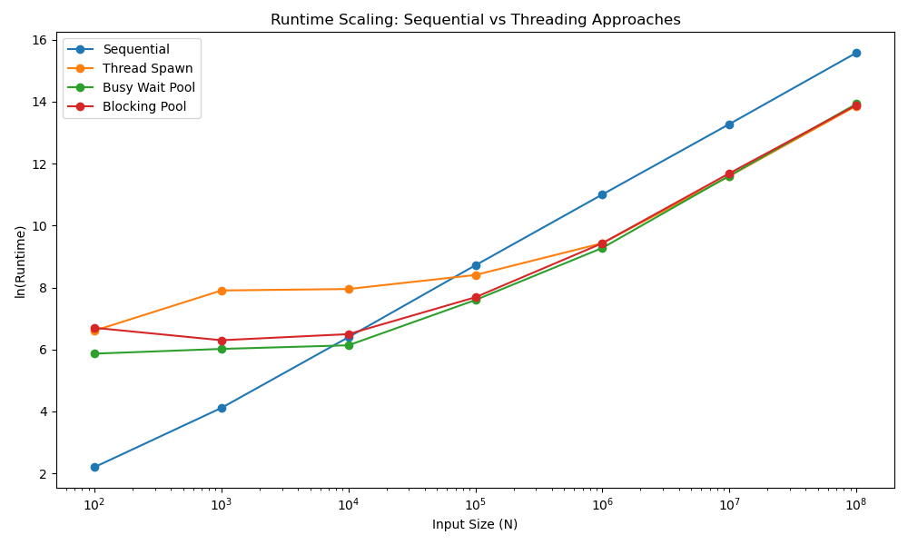

# Simple C++ Thread Pool

A lightweight thread pool implementation built while learning C++ concurrency.

## Features

- Fixed-size worker thread pool
- Task submission using `std::future`
- Blocking task queue using `std::condition_variable`
- Move-only task support via custom `function_wrapper`
- Graceful shutdown and thread joining

## Structure

```text
.
├── threadpool.hpp          # Thread pool implementation
├── threadsafe_queue.hpp    # Lock-based blocking queue
└── function_wrapper.hpp    # Move-only callable wrapper
```
## How to use

```cpp
threadpool pool(no_of_threads);

auto fut = pool.submit(callable);

/*
The submitted callable must be parameterless.
Use std::bind or a lambda to capture any required arguments.
*/

std::cout << fut.get() << '\n';
```

## Performance Evaluation

The thread pool was benchmarked against several execution strategies using a parallel accumulation workload across varying input sizes.

### Compared Approaches

- Sequential
- Thread Spawn
- Busy-Wait Pool
- Blocking Pool

### Results



The benchmark shows that:

- Thread creation overhead dominates for small workloads.
- Reusing worker threads is significantly more efficient than spawning threads repeatedly.
- The blocking pool performs similarly to the busy-wait pool while avoiding unnecessary CPU consumption when idle.
- As workload size increases, the thread pool scales substantially better than the thread-per-task approach.
- Queue synchronization overhead becomes the primary bottleneck at larger scales.

### Key Observation

Although busy-waiting can reduce wake-up latency, it continuously consumes CPU cycles while waiting for work. The blocking pool suspends idle worker threads using condition variables, eliminating unnecessary CPU usage. In the benchmark, the blocking pool eventually matches and slightly outperforms the busy-wait implementation while remaining significantly more resource-efficient.

## Current Limitations
- Queue uses a single mutex for all operations.
- No work stealing.
- No dynamic thread management.
- No task prioritization.
- No lock-free data structures.

## Future Improvements

- Add local worker queues.
- Implement work stealing.
- Investigate dynamic thread management.

## Requirements
- C++17 or later